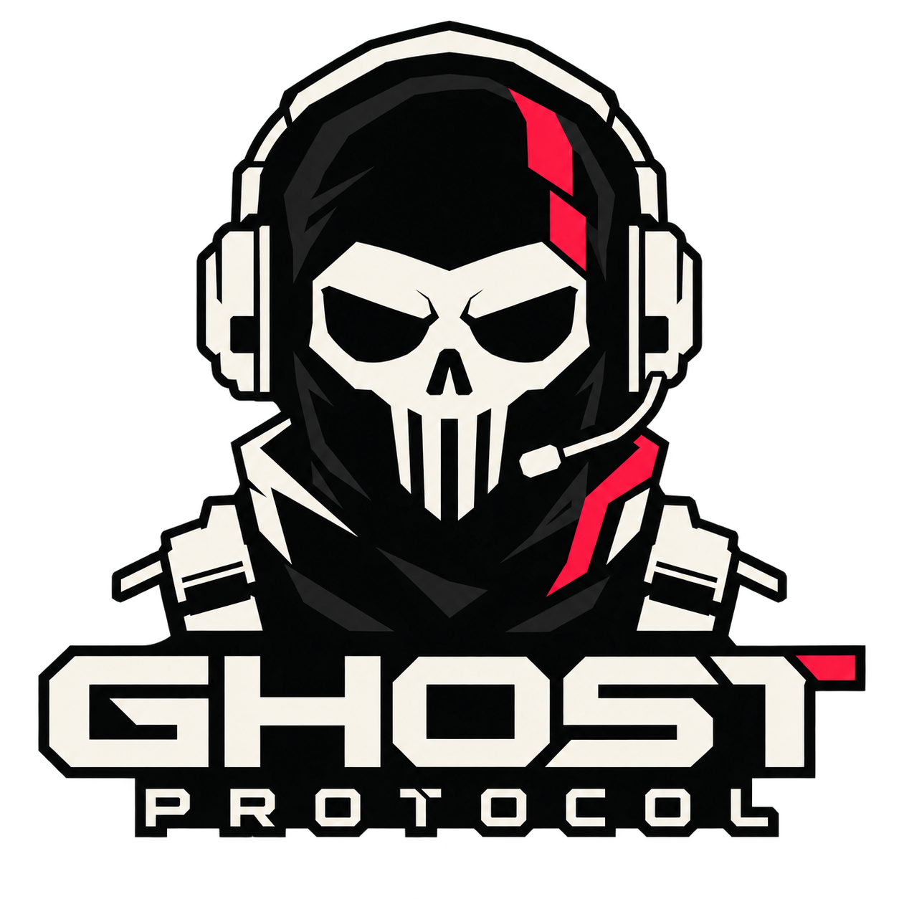

<p align="center">
  
</p>

<h1 align="center">GHOST PROTOCOL</h1>
<p align="center"><b>Are you in or out?</b></p>

<p align="center">
A 2D top-down stealth-action heist game. You can't see in the dark, so you listen.
</p>

---

## About

You are **Ghost**, a thief so quiet that nobody noticed him leave his own birthday party (with the cake). Tonight's job: **Gotham Central Bank**. Ten bags of cash, one night, and one sarcastic voice in your ear.

The bank is pitch black. The only way to see is to **ping**: send out a sound wave that briefly reveals walls, guards, lasers and loot. Every ping also tells the guards where you are. Stay quiet and you walk out clean. Get spotted and the lights come on, the screen flips from teal to red, police pour in, and the heist becomes a gunfight.

Written solo in C++17 with [raylib](https://www.raylib.com/), for Windows and the web.

## Features

- **Ping to see.** Tap for a small pulse, hold for a big one. Bigger pulses reveal more and make more noise.
- **Two ways to play.** Sneak the whole bank without an alarm (a "Ghost run" pays 25% extra) or go loud with guns and thermite.
- **Living guards.** Vision cones, detection meters, hearing, pagers, call-ins, cameras and laser tripwires.
- **Three guns and a takedown.** Suppressed pistol, SMG, shotgun, plus a silent melee knockout.
- **Police waves.** Cops, shield cops and heavies arrive on a clock once the alarm fires.
- **A full heist.** Keycard, power room, vault (quiet crack or thermite), dye packs, bags, bollards, van.
- **Flat vector style.** Bold shapes, a teal-to-red palette flip at the alarm, grain and glow.
- **A Handler with opinions.** Voiced, subtitled, and not telling you everything.
- **Payout screen.** Receipt-style breakdown with deductions, a rank stamp, and a twist.

## How to play

| Action | Input |
|---|---|
| Move | Arrow keys or WASD |
| Aim / Fire | Mouse / Left click |
| Ping | Space (tap = small, hold = big) |
| Sprint | Hold Shift (louder) |
| Crouch | Ctrl or C (quieter, slower) |
| Takedown | Right click, close to a guard |
| Interact | Hold E |
| Reload / Switch weapon | R / 1, 2 or mouse wheel |
| Throw bag | G |
| Objectives | Hold Tab |
| Pause / Fullscreen | Esc / F11 |

### The heist

1. **Back Door:** lockpick the Service Door in the alley.
2. **Red Card:** find the red keycard. Optionally loop the cameras at the security panel.
3. **Lights Out:** flip the breaker in the Power Room to open the vault gate.
4. **Open Sesame:** crack the vault quietly (25 s) or place thermite (75 s) and hold the line.
5. **Cash and Dye:** disarm the dye packs and grab the bags. You carry one at a time.
6. **Get Out:** lower the bollards, load the van, leave.

## Build from source

**Requirements:** CLion (or any CMake 3.20+ setup), a C++17 compiler (CLion's bundled MinGW works), and an internet connection for the first configure (dependencies are fetched by CMake).

```bash
git clone https://github.com/hjeandedieu/ghost-protocol.git
cd ghost-protocol

# Debug build with tests
cmake -S . -B build -DCMAKE_BUILD_TYPE=Debug -DGP_BUILD_TESTS=ON
cmake --build build
ctest --test-dir build --output-on-failure

# Run (from the repo root so assets/ is found)
./build/ghost_game        # Windows: build\ghost_game.exe
```

### Web build (WebAssembly)

Requires the [Emscripten SDK](https://emscripten.org/).

```bash
emcmake cmake -S . -B build-web -DCMAKE_BUILD_TYPE=Release
cmake --build build-web
```

Serve the output folder with any static web server and open it in a browser. Web-specific notes live in `docs/02_Architecture.md` section 10.

## Project structure

```
ghost-protocol/
  src/          core, world, entities, systems, render, ui, states
  assets/       config JSON, levels, fonts, UI art, audio, shaders
  tests/        GoogleTest suites for every logic system
  tools/        level validator, voice-line generator
  web/          Emscripten shell page
  docs/         full documentation (start with docs/README.md)
```

## Documentation

Everything about the game is written down in [`docs/`](./docs), and the docs win over the code if they disagree.

| Doc | What it covers |
|---|---|
| [`01_GDD.md`](./docs/01_GDD.md) | Design, story, exact numbers, requirements |
| [`02_Architecture.md`](./docs/02_Architecture.md) | Layers, game loop, rendering, web rules |
| [`03_Systems_Contract.md`](./docs/03_Systems_Contract.md) | Events, state machines, interfaces |
| [`04_Data_Formats.md`](./docs/04_Data_Formats.md) | Config, level files, saves |
| [`05_Design_Docs.md`](./docs/05_Design_Docs.md) | Palette, UI, VFX, audio, voice script |
| [`06_Wireframes.html`](./docs/06_Wireframes.html) | Screen wireframes |
| [`07_Development_Guidelines.md`](./docs/07_Development_Guidelines.md) | Git, code style, CI, QA checklist |
| [`08_Implementation_Plan.md`](./docs/08_Implementation_Plan.md) | Day-by-day build plan |

AI coding tools working in this repo must follow [`AGENTS.md`](./AGENTS.md).

## Status

| Week | Dates (2026) | Goal | State |
|---|---|---|---|
| 1 | 5 to 11 Oct | Foundation, movement, ping | Planned |
| 2 | 12 to 18 Oct | Full stealth systems | Planned |
| 3 | 19 to 25 Oct | Loud phase and full mission | Planned |
| 4 | 26 to 31 Oct | Menus, audio, voice, polish, web build, submit | Planned |

Update the State column as each week is tagged (`v0.1-week1` through `v1.0-submission`).

## Contributing

This is a solo project built on a deadline, so pull requests are not being accepted. Bug reports are welcome as GitHub issues.

## Credits and licences

- **Design, code, story:** RedBlue
- **Voice:** generated text-to-speech
- **Fonts:** Orbitron and Inter (SIL Open Font License)
- **Engine:** raylib (zlib licence)
- **Music and sound effects:** see [`ASSETS.md`](./ASSETS.md) for each file's author and licence

All character names, art, story and audio are original. Add a `LICENSE` file for the code before making the repository public.
