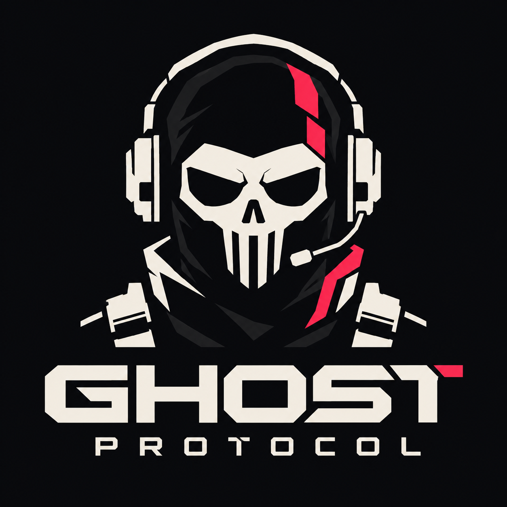

<p align="center">
  
</p>

# Ghost Protocol

**Are you in or out?**

A single-player, top-down stealth-action bank heist built in C++17 with raylib 5.5.
Sound pings reveal the dark bank while drawing guards toward you. An alarm turns
the stealth mission into a loud fight for the cash and the getaway van.

You are **Ghost**, a thief so quiet nobody noticed him leave his own birthday
party with the cake. Tonight's job: **Gotham Central Bank**. Ten bags of cash,
one night, and one sarcastic voice in your ear.

## Current milestone

Day 4 foundation: Boot transitions to a placeholder Menu; Enter loads Gotham
Central Bank. Tiles use the initial passability and light zones from the map and
JSON. F3 toggles the full-bank overview in Debug builds; normal view starts at
the alley spawn. Rendering uses a 1280x720 surface with letterboxing.
Resize the window to change its size, F11 toggles fullscreen, and Escape quits.
The existing fixed 60 Hz loop, typed tuning, logger, seeded RNG, and headless
unit tests remain in place. Movement, reveal, and furnishing are later milestones.
The level validator checks the shipped map and entity coordinates.

## Build and test

Requires CMake 3.20+, a C++17 compiler, and Python 3 for level-validation tests.
The first configure downloads raylib 5.5, nlohmann_json 3.11.3, and GoogleTest
1.15.2. Put the compiler's bin directory on PATH for terminal builds.

In CLion, open this folder and select the bundled MinGW toolchain under
Settings > Build, Execution, Deployment > Toolchains. Run `ghost_game`.
Enable `GP_BUILD_TESTS` in the CMake profile to build `ghost_tests`.

With MinGW and Ninja available:

```powershell
cmake -S . -B build -G Ninja -DCMAKE_BUILD_TYPE=Debug -DGP_BUILD_TESTS=ON
cmake --build build
ctest --test-dir build --output-on-failure --stop-on-failure
.\build\ghost_game.exe
```

If CMake cannot locate Python, pass `-DPython3_EXECUTABLE=<path-to-python>`.
Disable desktop tests explicitly with `-DGP_BUILD_TESTS=OFF` for a game-only build.
The build copies assets and the selected MinGW runtime DLLs beside executables.
Desktop startup uses the executable directory, so assets load regardless of the
launcher's working directory. Keep the copied `assets/` folder beside the executable.
Startup loads `assets/config/tuning.json` and logs its RNG seed to the console
and `logs/ghost.log`. Invalid tuning uses documented defaults with warnings.

Validate the runtime level or its documentation source copy:

```powershell
python tools/validate_level.py
python tools/validate_level.py docs/levels/gotham_central.json
```

`ghost_core` holds window-independent logic, state-stack management, and viewport
math. `ghost_game` owns the window, concrete screens, and renderer. `ghost_tests`
runs without opening a window; CTest also runs the Python level checks.

## Visual direction

Gameplay images define the furnished vector bank, dark teal stealth, red Loud
lighting, gold effects, and stable framed HUD. The video in `reference/` defines
geometric transitions, layered presentation, and visual emphasis. These are the
finished target; the current placeholder screens are development scaffolding.
Reference media are excluded from runtime assets. Wireframes are pending delivery.

## Documentation

The docs define game behavior. Read the GDD, architecture, systems contract,
data formats, and implementation plan in that order. Contract changes must be
documented before implementation.

| Document | Contents |
|---|---|
| [Game design](docs/01_GDD.md) | Story, mechanics, requirements, priorities |
| [Architecture](docs/02_Architecture.md) | Layers, loop, rendering, web rules |
| [Systems contract](docs/03_Systems_Contract.md) | Events, state machines, interfaces |
| [Data formats](docs/04_Data_Formats.md) | Configuration, levels, saves, assets |
| [Visual and audio design](docs/05_Design_Docs.md) | Palette, screens, effects, voice script |
| [Development guidelines](docs/07_Development_Guidelines.md) | Git, code style, CI, testing, QA |
| [Implementation plan](docs/08_Implementation_Plan.md) | Daily tasks and milestones |
| [Visual reference](docs/09_Visual_Reference.md) | Gameplay appearance, motion, acceptance criteria |
| [Agent instructions](AGENTS.md) | Rules for AI contributors |

## Project structure

```text
Ghost Protocol/
  CMakeLists.txt
  README.md
  AGENTS.md
  ASSETS.md
  src/
    main.cpp
    core/               Application, tuning, logger, timing, input, RNG
    states/             State stack and Boot/Menu/Play placeholders
    render/             Drawing and letterbox viewport math
  tests/                C++ logic tests and Python validator tests
  tools/                Level validator
  assets/
    config/             tuning.json
    levels/             Runtime map and entity data
  docs/
    levels/             Level source copies and bank blueprint
  reference/            Gameplay images, motion video, logo source
```

Keep the documentation and runtime level copies synchronized. IDE files, logs,
build outputs, and saves are ignored by Git. Future modules are added on their
implementation days.

## Schedule and platforms

Windows is primary; WebAssembly is secondary. The web build and Emscripten shell
are planned later; no working browser package is claimed by this milestone.
See Architecture section 10 for web requirements.

| Week | Dates (2026) | Goal |
|---|---|---|
| 1 | October 5-11 | Foundation, movement, ping |
| 2 | October 12-18 | Full stealth systems |
| 3 | October 19-25 | Loud phase and complete mission |
| 4 | October 26-31 | Menus, audio, polish, web build, QA, submission |

Submission is planned for October 31, with November 1 as the deadline buffer.

## Contributing and credits

This is a solo project built on a deadline. External feature pull requests are
not being accepted; bug reports are welcome as GitHub issues.

Design, code, and story: **RedBlue**. Engine: raylib. Planned fonts: Orbitron and
Inter; planned Handler voice: generated text-to-speech. Individual runtime asset
sources and licences are recorded in [ASSETS.md](ASSETS.md). Supplied references
with unknown provenance are documented there without claiming redistribution
rights. A code licence has not yet been selected.
